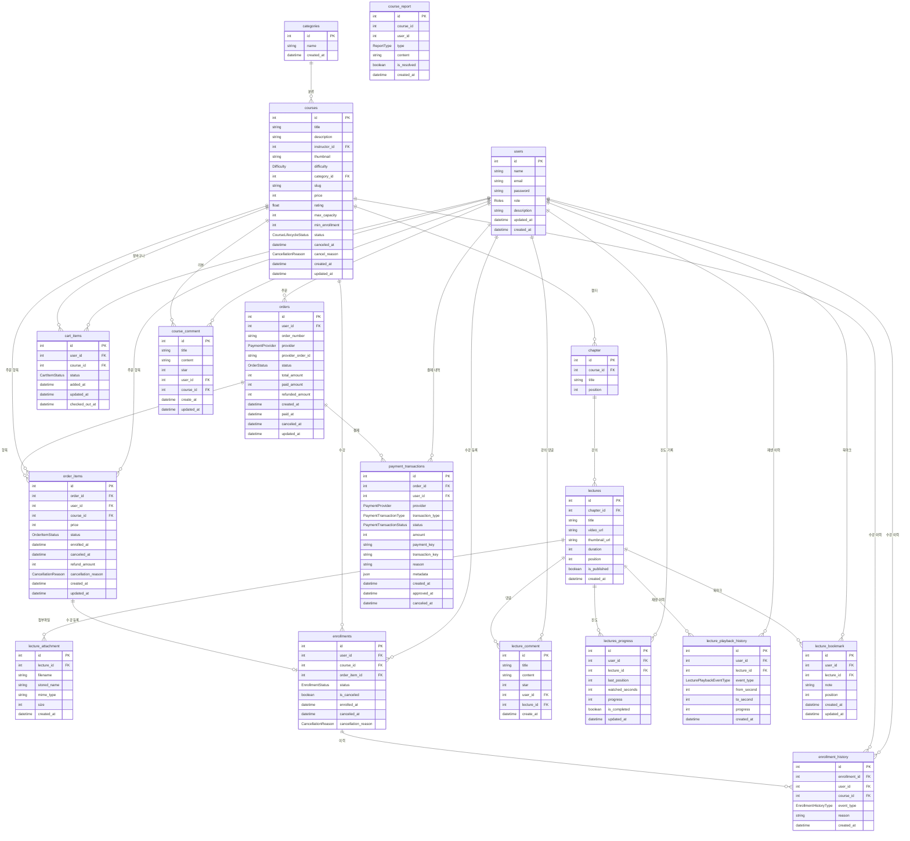

# SEC101 P1 — ERD (Entity Relationship Diagram)



---

## Enum 목록

| Enum | 값 |
|---|---|
| `Roles` | STUDENT, INSTRUCTOR, ADMIN |
| `Difficulty` | EASY, MEDIUM, HARD |
| `CourseLifecycleStatus` | DRAFT, OPEN, CANCELED |
| `CartItemStatus` | ACTIVE, CHECKED_OUT, REMOVED |
| `EnrollmentStatus` | ACTIVE, CANCELED, REFUNDED |
| `OrderStatus` | PENDING, PAID, PARTIALLY_REFUNDED, REFUNDED, CANCELED |
| `OrderItemStatus` | PENDING, ENROLLED, CANCELED, REFUNDED |
| `PaymentProvider` | TOSS, DEMO |
| `PaymentTransactionType` | PAYMENT, REFUND, CANCEL |
| `PaymentTransactionStatus` | COMPLETED, FAILED, CANCELED |
| `CancellationReason` | USER_REQUEST, COURSE_CANCELED, CAPACITY_EXCEEDED, UNDER_ENROLLED, OTHER |
| `EnrollmentHistoryType` | ENROLLED, CANCELED, REFUNDED |
| `LecturePlaybackEventType` | STARTED, PROGRESS, RESUMED, COMPLETED |
| `ReportType` | COPYRIGHT, WRONG_INFO, OTHER |

---

## 핵심 관계 요약

```
users ──┬──> cart_items ──> courses
        ├──> orders ──> order_items ──> enrollments ──> enrollment_history
        ├──>            payment_transactions
        ├──> course_comment ──> courses
        ├──> lecture_comment ──> lectures
        ├──> lectures_progress ──> lectures
        ├──> lecture_playback_history ──> lectures
        └──> lecture_bookmark ──> lectures

categories ──> courses ──> chapter ──> lectures ──┬──> lecture_attachment
                                                   ├──> lectures_progress
                                                   ├──> lecture_playback_history
                                                   ├──> lecture_bookmark
                                                   └──> lecture_comment
```
