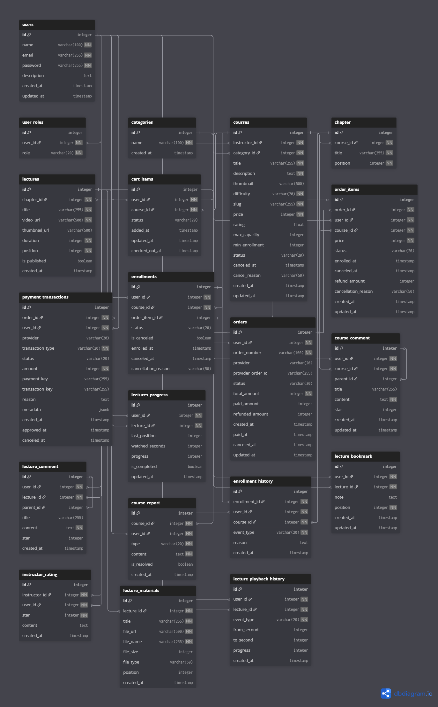

# sec101 - 데이터베이스 & 데이터 모델 설계

## 데이터베이스 선택: PostgreSQL

| 기준 | 근거 |
|-------------|
| JSON 지원 | 강의 자료 저장 |
| 확장성 | 커스텀 데이터, 함수를 지원, 추후 학습 데이터 분석 |
| 관계형 데이터 | 수강생 - 강의 - 강사 - 결제 - 평점 복잡한 관계 |

---

## ERD (Entity Relationship Diagram)


---

## 테이블 상세 정의
### 1. users (사용자)
```sql
CREATE TABLE users (
    id          SERIAL PRIMARY KEY,
    name        VARCHAR(100) NOT NULL,
    email       VARCHAR(255) NOT NULL UNIQUE,       -- 로그인 식별자
    password    VARCHAR(255) NOT NULL,
    description TEXT         DEFAULT '',
    created_at  TIMESTAMP    DEFAULT NOW(),
    updated_at  TIMESTAMP    DEFAULT NOW()
);
```

> roles는 user_roles junction 테이블로 분리 — 강사와 수강생 역할 동시 보유 가능


### 2. user_roles (사용자 역할 — junction)
```sql
CREATE TABLE user_roles (
    id      SERIAL PRIMARY KEY,
    user_id INTEGER NOT NULL REFERENCES users(id) ON DELETE CASCADE,
    role    VARCHAR(20) NOT NULL,                   -- STUDENT | INSTRUCTOR | ADMIN

    UNIQUE(user_id, role)
);
```

### 3. categories (카테고리)
```sql
CREATE TABLE categories (
    id         SERIAL PRIMARY KEY,
    name       VARCHAR(100) NOT NULL,
    created_at TIMESTAMP DEFAULT NOW()
);
```

### 4. courses (강의)
```sql
CREATE TABLE courses (
    id             SERIAL PRIMARY KEY,
    instructor_id  INTEGER NOT NULL REFERENCES users(id),
    category_id    INTEGER NOT NULL REFERENCES categories(id),
    title          VARCHAR(255) NOT NULL,
    description    TEXT         NOT NULL,
    thumbnail      VARCHAR(500),
    difficulty     VARCHAR(20)  NOT NULL,            -- EASY | MEDIUM | HARD
    slug           VARCHAR(255) NOT NULL UNIQUE,     -- SEO용 URL
    price          INTEGER      NOT NULL,
    rating         FLOAT        DEFAULT 0,           -- 집계 함수로 관리 권장
    max_capacity   INTEGER      DEFAULT 30,
    min_enrollment INTEGER      DEFAULT 1,
    status         VARCHAR(20)  DEFAULT 'OPEN',      -- OPEN | CANCELED
    canceled_at    TIMESTAMP,
    cancel_reason  VARCHAR(50),
    created_at     TIMESTAMP    DEFAULT NOW(),
    updated_at     TIMESTAMP    DEFAULT NOW()
);

CREATE INDEX idx_courses_instructor ON courses(instructor_id);
CREATE INDEX idx_courses_category   ON courses(category_id);
CREATE INDEX idx_courses_slug       ON courses(slug);
```

### 5. chapter (챕터)
```sql
CREATE TABLE chapter (
    id        SERIAL PRIMARY KEY,
    course_id INTEGER NOT NULL REFERENCES courses(id) ON DELETE CASCADE,
    title     VARCHAR(255) NOT NULL,
    position  INTEGER      NOT NULL,

    UNIQUE(course_id, position)
);
```

### 6. lectures (강의 영상)
```sql
CREATE TABLE lectures (
    id            SERIAL PRIMARY KEY,
    chapter_id    INTEGER NOT NULL REFERENCES chapter(id) ON DELETE CASCADE,
    title         VARCHAR(255) NOT NULL,
    video_url     VARCHAR(500) NOT NULL,             -- S3 또는 외부 URL
    thumbnail_url VARCHAR(500),
    duration      INTEGER      NOT NULL,             -- 초 단위
    position      INTEGER      NOT NULL,
    is_published  BOOLEAN      DEFAULT FALSE,
    created_at    TIMESTAMP    DEFAULT NOW(),

    UNIQUE(chapter_id, position)
);
```

### 7. cart_items (장바구니)
```sql
CREATE TABLE cart_items (
    id             SERIAL PRIMARY KEY,
    user_id        INTEGER NOT NULL REFERENCES users(id) ON DELETE CASCADE,
    course_id      INTEGER NOT NULL REFERENCES courses(id),
    status         VARCHAR(20) DEFAULT 'ACTIVE',     -- ACTIVE | CHECKED_OUT | REMOVED
    added_at       TIMESTAMP   DEFAULT NOW(),
    updated_at     TIMESTAMP   DEFAULT NOW(),
    checked_out_at TIMESTAMP
);

CREATE INDEX idx_cart_user_status   ON cart_items(user_id, status);
CREATE INDEX idx_cart_course_status ON cart_items(course_id, status);
```

### 8. orders (주문)
```sql
CREATE TABLE orders (
    id                SERIAL PRIMARY KEY,
    user_id           INTEGER NOT NULL REFERENCES users(id),
    order_number      VARCHAR(100) NOT NULL UNIQUE,
    provider          VARCHAR(20)  DEFAULT 'TOSS',   -- TOSS | DEMO
    provider_order_id VARCHAR(255),
    status            VARCHAR(30)  DEFAULT 'PENDING',-- PENDING | PAID | PARTIALLY_REFUNDED | REFUNDED | CANCELED
    total_amount      INTEGER      NOT NULL,
    paid_amount       INTEGER      DEFAULT 0,
    refunded_amount   INTEGER      DEFAULT 0,
    created_at        TIMESTAMP    DEFAULT NOW(),
    paid_at           TIMESTAMP,
    canceled_at       TIMESTAMP,
    updated_at        TIMESTAMP    DEFAULT NOW()
);

CREATE INDEX idx_orders_user_created ON orders(user_id, created_at);
```

### 9. order_items (주문 항목)
```sql
CREATE TABLE order_items (
    id                  SERIAL PRIMARY KEY,
    order_id            INTEGER NOT NULL REFERENCES orders(id),
    user_id             INTEGER NOT NULL REFERENCES users(id),
    course_id           INTEGER NOT NULL REFERENCES courses(id),
    price               INTEGER NOT NULL,
    status              VARCHAR(20) DEFAULT 'PENDING', -- PENDING | ENROLLED | CANCELED | REFUNDED
    enrolled_at         TIMESTAMP,
    canceled_at         TIMESTAMP,
    refund_amount       INTEGER     DEFAULT 0,
    cancellation_reason VARCHAR(50),
    created_at          TIMESTAMP   DEFAULT NOW(),
    updated_at          TIMESTAMP   DEFAULT NOW()
);

CREATE INDEX idx_order_items_order_status ON order_items(order_id, status);
CREATE INDEX idx_order_items_user_course  ON order_items(user_id, course_id);
```

### 10. payment_transactions (결제 트랜잭션)
```sql
CREATE TABLE payment_transactions (
    id               SERIAL PRIMARY KEY,
    order_id         INTEGER NOT NULL REFERENCES orders(id),
    user_id          INTEGER NOT NULL REFERENCES users(id),
    provider         VARCHAR(20) DEFAULT 'TOSS',
    transaction_type VARCHAR(20) NOT NULL,           -- PAYMENT | REFUND | CANCEL
    status           VARCHAR(20) DEFAULT 'COMPLETED',-- COMPLETED | FAILED | CANCELED
    amount           INTEGER     NOT NULL,
    payment_key      VARCHAR(255),
    transaction_key  VARCHAR(255),
    reason           TEXT,
    metadata         JSONB,
    created_at       TIMESTAMP   DEFAULT NOW(),
    approved_at      TIMESTAMP,
    canceled_at      TIMESTAMP
);

CREATE INDEX idx_payment_order_created ON payment_transactions(order_id, created_at);
CREATE INDEX idx_payment_user_type     ON payment_transactions(user_id, transaction_type);
```

### 11. enrollments (수강 등록)
```sql
CREATE TABLE enrollments (
    id                  SERIAL PRIMARY KEY,
    user_id             INTEGER NOT NULL REFERENCES users(id),
    course_id           INTEGER NOT NULL REFERENCES courses(id),
    order_item_id       INTEGER UNIQUE REFERENCES order_items(id), -- 무료 강의는 NULL 가능
    status              VARCHAR(20) DEFAULT 'ACTIVE', -- ACTIVE | CANCELED | REFUNDED
    is_canceled         BOOLEAN     DEFAULT FALSE,
    enrolled_at         TIMESTAMP   DEFAULT NOW(),
    canceled_at         TIMESTAMP,
    cancellation_reason VARCHAR(50)
);

CREATE INDEX idx_enrollments_user_course ON enrollments(user_id, course_id, status);
```

### 12. enrollment_history (수강 이력)
```sql
CREATE TABLE enrollment_history (
    id            SERIAL PRIMARY KEY,
    enrollment_id INTEGER NOT NULL REFERENCES enrollments(id),
    user_id       INTEGER NOT NULL REFERENCES users(id),
    course_id     INTEGER NOT NULL REFERENCES courses(id),
    event_type    VARCHAR(20) NOT NULL,              -- ENROLLED | CANCELED | REFUNDED
    reason        TEXT,
    created_at    TIMESTAMP DEFAULT NOW()
);

CREATE INDEX idx_enroll_history_enrollment ON enrollment_history(enrollment_id, created_at);
CREATE INDEX idx_enroll_history_user       ON enrollment_history(user_id, course_id, created_at);
```

### 13. course_comment (강의 댓글 / 대댓글)
```sql
CREATE TABLE course_comment (
    id         SERIAL PRIMARY KEY,
    user_id    INTEGER NOT NULL REFERENCES users(id),
    course_id  INTEGER NOT NULL REFERENCES courses(id),
    parent_id  INTEGER REFERENCES course_comment(id), -- NULL이면 최상위, 값 있으면 대댓글
    title      VARCHAR(255),
    content    TEXT        NOT NULL,
    star       INTEGER     DEFAULT 0,                -- 0이면 평점 없음(대댓글)
    created_at TIMESTAMP   DEFAULT NOW(),
    updated_at TIMESTAMP   DEFAULT NOW()
);

CREATE INDEX idx_course_comment_course ON course_comment(course_id, created_at);
```

### 14. lecture_comment (강의 영상 댓글 / 대댓글)
```sql
CREATE TABLE lecture_comment (
    id         SERIAL PRIMARY KEY,
    user_id    INTEGER NOT NULL REFERENCES users(id),
    lecture_id INTEGER NOT NULL REFERENCES lectures(id),
    parent_id  INTEGER REFERENCES lecture_comment(id), -- 대댓글 지원
    title      VARCHAR(255),
    content    TEXT      NOT NULL,
    star       INTEGER   DEFAULT 0,
    created_at TIMESTAMP DEFAULT NOW()
);
```

### 15. lectures_progress (강의 진도)
```sql
CREATE TABLE lectures_progress (
    id              SERIAL PRIMARY KEY,
    user_id         INTEGER NOT NULL REFERENCES users(id),
    lecture_id      INTEGER NOT NULL REFERENCES lectures(id),
    last_position   INTEGER DEFAULT 0,               -- 마지막 재생 위치 (초)
    watched_seconds INTEGER DEFAULT 0,               -- 실제 시청 시간 (초)
    progress        INTEGER DEFAULT 0,               -- 진도율 (0~100)
    is_completed    BOOLEAN DEFAULT FALSE,
    updated_at      TIMESTAMP DEFAULT NOW(),

    UNIQUE(user_id, lecture_id)
);

CREATE INDEX idx_progress_lecture ON lectures_progress(lecture_id, progress);
```

### 16. lecture_playback_history (재생 이벤트 로그)
```sql
CREATE TABLE lecture_playback_history (
    id          SERIAL PRIMARY KEY,
    user_id     INTEGER NOT NULL REFERENCES users(id),
    lecture_id  INTEGER NOT NULL REFERENCES lectures(id),
    event_type  VARCHAR(20) NOT NULL,                -- STARTED | PROGRESS | RESUMED | COMPLETED
    from_second INTEGER     DEFAULT 0,
    to_second   INTEGER     DEFAULT 0,
    progress    INTEGER     DEFAULT 0,
    created_at  TIMESTAMP   DEFAULT NOW()
);

CREATE INDEX idx_playback_user_lecture ON lecture_playback_history(user_id, lecture_id, created_at);
```

### 17. lecture_bookmark (강의 북마크)
```sql
CREATE TABLE lecture_bookmark (
    id         SERIAL PRIMARY KEY,
    user_id    INTEGER NOT NULL REFERENCES users(id),
    lecture_id INTEGER NOT NULL REFERENCES lectures(id),
    note       TEXT,
    position   INTEGER   NOT NULL,                   -- 북마크 위치 (초)
    created_at TIMESTAMP DEFAULT NOW(),
    updated_at TIMESTAMP DEFAULT NOW()
);

CREATE INDEX idx_bookmark_user_lecture ON lecture_bookmark(user_id, lecture_id, created_at);
```

### 18. instructor_rating (강사 평점) — 추가
```sql
CREATE TABLE instructor_rating (
    id            SERIAL PRIMARY KEY,
    instructor_id INTEGER NOT NULL REFERENCES users(id), -- INSTRUCTOR 역할
    user_id       INTEGER NOT NULL REFERENCES users(id), -- 평가한 수강생
    star          INTEGER NOT NULL CHECK (star BETWEEN 1 AND 5),
    content       TEXT,
    created_at    TIMESTAMP DEFAULT NOW(),

    UNIQUE(instructor_id, user_id)
);
```

### 19. course_report (강의 신고) — 추가
```sql
CREATE TABLE course_report (
    id          SERIAL PRIMARY KEY,
    course_id   INTEGER NOT NULL REFERENCES courses(id),
    user_id     INTEGER NOT NULL REFERENCES users(id),
    type        VARCHAR(20) NOT NULL,                -- COPYRIGHT | WRONG_INFO | OTHER
    content     TEXT        NOT NULL,
    is_resolved BOOLEAN     DEFAULT FALSE,
    created_at  TIMESTAMP   DEFAULT NOW()
);

CREATE INDEX idx_report_course     ON course_report(course_id);
CREATE INDEX idx_report_resolved   ON course_report(is_resolved, created_at);
```

---

### 20. lecture_matirials (강의 자료)
```sql
CREATE TABLE lecture_materials (
    id          SERIAL PRIMARY KEY,
    lecture_id  INTEGER NOT NULL REFERENCES lectures(id) ON DELETE CASCADE,
    title       VARCHAR(255) NOT NULL,           -- "실습 파일 1"
    file_url    VARCHAR(500) NOT NULL,           -- S3 URL
    file_name   VARCHAR(255) NOT NULL,           -- "practice_01.zip"
    file_size   INTEGER,                         -- bytes
    file_type   VARCHAR(50),                     -- "application/zip", "application/pdf"
    position    INTEGER DEFAULT 0,               -- 정렬 순서
    created_at  TIMESTAMP DEFAULT NOW()
);
```

## 시드 데이터 요약

초기 카테고리 및 테스트 데이터:

| 항목 | 내용 |
|---|---|
| 관리자 계정 | admin 1명 |
| 강사 계정 | 테스트용 2~3명 |
| 카테고리 | 웹 보안, 시스템 보안, 네트워크 보안, 리버싱 등 |
| 샘플 강의 | 카테고리별 1~2개 |